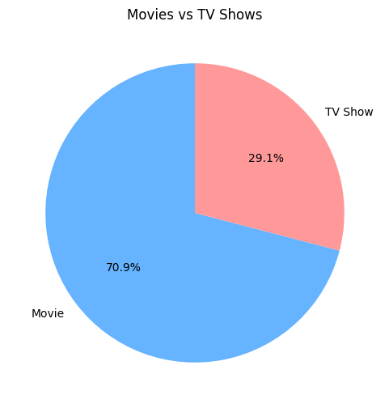
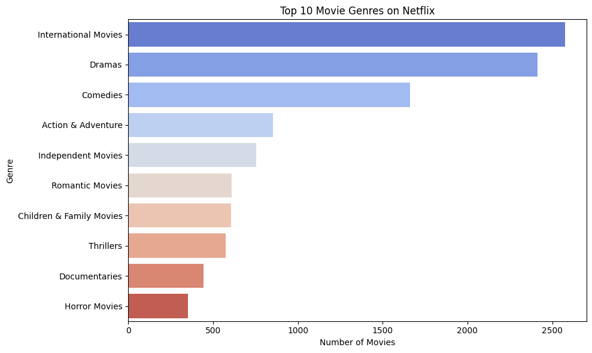
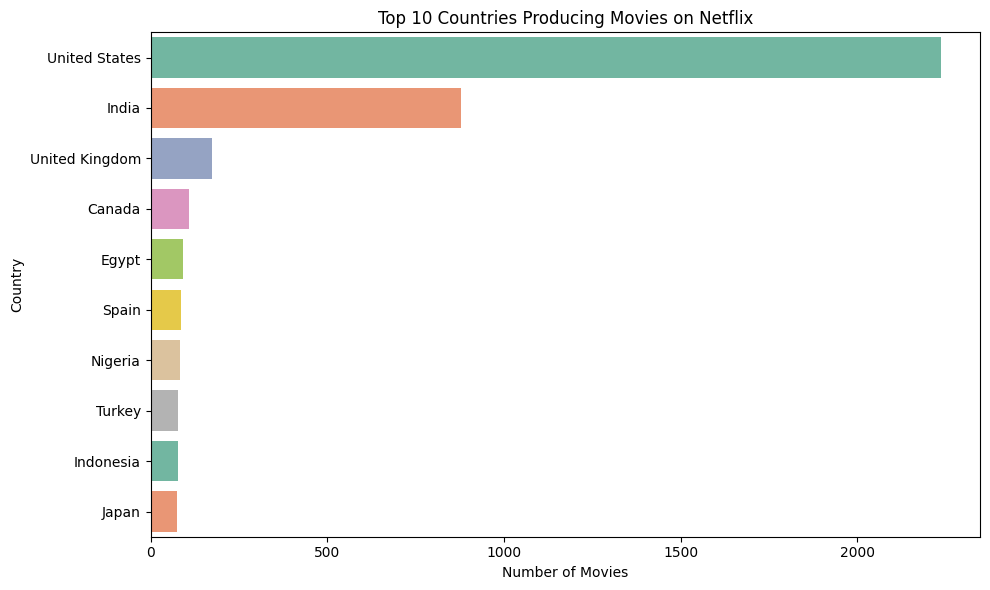
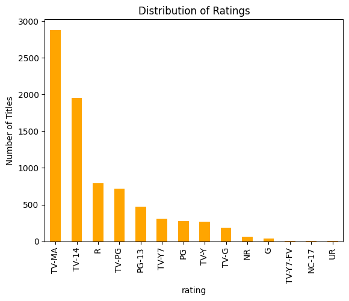

# Netflix Content Analytics

## 📌 Project Overview

This project analyzes the Netflix Titles dataset using Python to explore content trends, genre distribution, ratings, and regional patterns through Exploratory Data Analysis (EDA). The analysis provides valuable insights into Netflix's content library and supports data-driven content strategy.

---

## 🛠 Technologies Used

- Python
- Pandas
- NumPy
- Matplotlib
- Seaborn

---

## 📂 Dataset

Netflix Titles Dataset

---

## 📁 Project Files

- projectnetflix.ipynb
- netflix_titles.csv
- netflix_cleaned.csv

---

## 📊 Project Workflow

1. Data Cleaning
2. Missing Value Handling
3. Data Transformation
4. Exploratory Data Analysis (EDA)
5. Data Visualization
6. Business Insights

---

## 📈 Key Visualizations

### 🎬 Movies vs TV Shows

### 🎭 Top Movie Genres

### 🌍 Top Countries Producing Movies

### ⭐ Distribution of Ratings

---

## 📌 Key Insights

- Movies represent approximately **71%** of the Netflix content library.
- **International Movies** and **Dramas** are the most common genres.
- The **United States** is the leading producer of Netflix titles, followed by India.
- **TV-MA** is the most frequently assigned content rating.
- The analysis highlights global content trends and audience preferences through visual exploration.

---

## 🎯 Business Value

This project demonstrates how exploratory data analysis (EDA) can uncover meaningful insights from streaming platform data, supporting content strategy, audience understanding, and data-driven decision-making.
